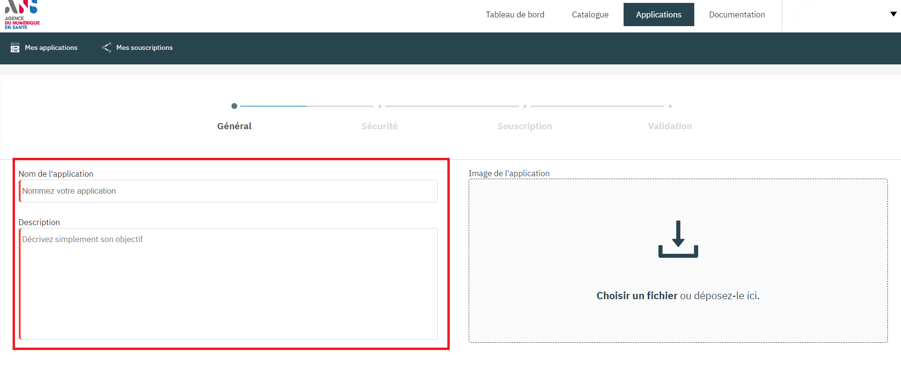
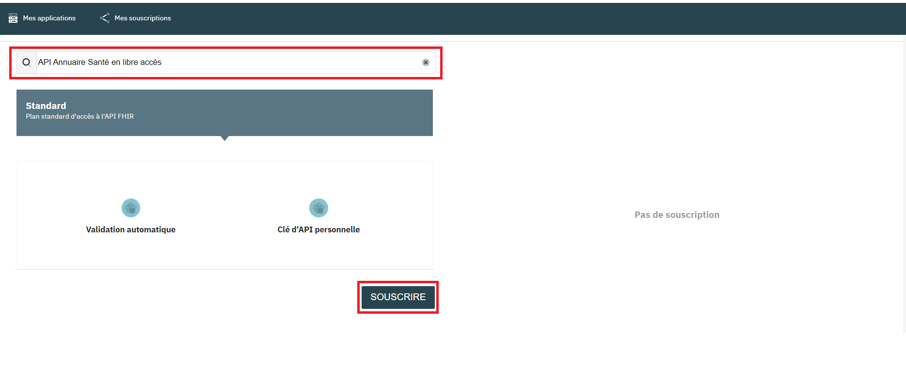

Pour appeler l'API, il est nécessaire de spécifier une API Key dans le header. Pour obtenir cette clé, vous devez vous rendre sur l’outil de gestion d’API
[Gravitee](https://portal.api.esante.gouv.fr/catalog/api/962f412b-e08e-4ee7-af41-2be08eeee7f6){:target="_blank"}.


### Comment souscrire à l'API?
L’outil de gestion d’API « Gravitee », permet à l’utilisateur de récupérer son jeton d’authentification « API KEY » de façon automatique. Une fois le jeton récupéré, l’utilisateur peut s’authentifier et utiliser l'API.

Pour pouvoir récupérer la clé d'API et utiliser l’API, l’utilisateur doit :
- Créer au moins une application dans l’interface Portail
- Souscrire cette application à l’API 

### Souscrire à l'API sans application existante
Cette partie concerne les utilisateurs qui n’ont pas encore créé d’application à souscrire à l’API.
Pour créer une application, vous devez vous rendre sur le Portail APIM, onglet Applications, et cliquer sur Créer une App :

{:style="max-width:600px"}

Ensuite, remplissez les informations générales requises pour l'application :

{:style="max-width:600px"}

Pour souscrire votre application à l’API, vous pouvez rechercher API Annuaire Santé en libre accès.

{:style="max-width:600px"}
{:style="max-width:600px"}

Lorsque la création de l’application et sa souscription à l’API sont terminées, une clé d'API vous sera automatiquement générée.
Vous pourrez retrouver cette clé dans l’onglet "Souscriptions" de votre Application :

{:style="max-width:600px"}

### Souscrire une application déjà existante à l'API
TODO

### Votre premier appel API

Pour cette section, nous utilisons curl qui est un outil présent sur la plupart des plateformes windows 10+, macos, linux.

Lancez la commande suivante pour récupérer le CapabilityStatement FHIR (liste des fonctionnalités du serveur) : 


TIPS| Dans chaque exemple, veuillez remplacer {{site.ans.demo_key }} par votre clé api.


<div class="code-sample"><div class="tab-content" data-name="bash">


curl -H "ESANTE-API-KEY: {{site.ans.demo_key }}" "{{site.ans.api_url}}/fhir/metadata?_pretty=true&_format=json"


  
</div></div>


Si tout s'est bien passé, vous devriez avoir un résultat similaire à : 

```json
{
  "resourceType": "CapabilityStatement",
  "fhirVersion": "4.0.1",
  "format": [ "application/fhir+xml", "xml", "application/fhir+json", "json" ],
  "rest": [ {
    ...
```

&nbsp;

NOTE| Le capability statement permet de connaitre les fonctionnalités disponibles sur le serveur FHIR (paramètres, ressources...).


Vous pouvez lancer la même requête sur une ressource par exemple pour récupérer les Practitioner:


<div class="code-sample"><div class="tab-content" data-name="bash">


curl -H "ESANTE-API-KEY: {{site.ans.demo_key }}" "{{site.ans.api_url}}/fhir/Practitioner?_pretty=true&_format=json"


</div></div>


La réponse devrait ressembler à cela :

```json
{
  "resourceType": "Bundle",
  "entry": [ {
    "fullUrl": "https://.../fhir/v1/Practitioner/pra-59",
    "resource": {
      "resourceType": "Practitioner",
      "id": "pra-59",
    }
  }, {
    "fullUrl": "https://.../fhir/v1/Practitioner/pra-57",
    "resource": {
      "resourceType": "Practitioner",
      "id": "pra-57",
      ...
    }
  }
  ...
  ]
}
```

&nbsp;


## Aller plus loin


### Ressources internes 

<div class="wysiwyg" markdown="1">
* Démarrage par langage: [JAVA]({{ '/pages/documentation/starters/java-starter.html' | relative_url }}),  [PHP]({{ '/pages/documentation/starters/php-starter.html' | relative_url }})
* [Accéder aux ressources]({{ '/pages/hub' | relative_url }})
* [Cas d'utilisation de synchronisation]({{ '/pages/use-cases/full/index' | relative_url }})
* [Cas d'utilisation d'appels unitaires]({{ '/pages/use-cases/practitioner-detail/index' | relative_url }})
</div>

&nbsp;

### Ressources externes

<div class="wysiwyg" markdown="1">
* [Site officiel de FHIR](https://www.hl7.org/fhir/){:target="_blank"}
* [Librairie Java FHIR](https://hapifhir.io/){:target="_blank"}
* [Profils de l'annuaire santé](TODO){:target="_blank"}
</div>
